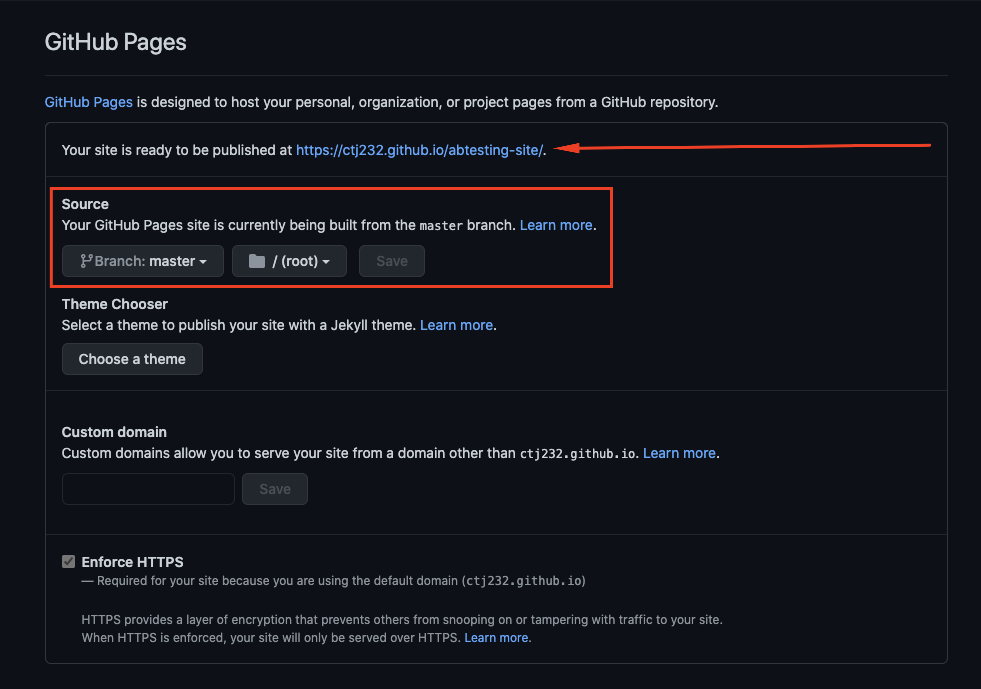
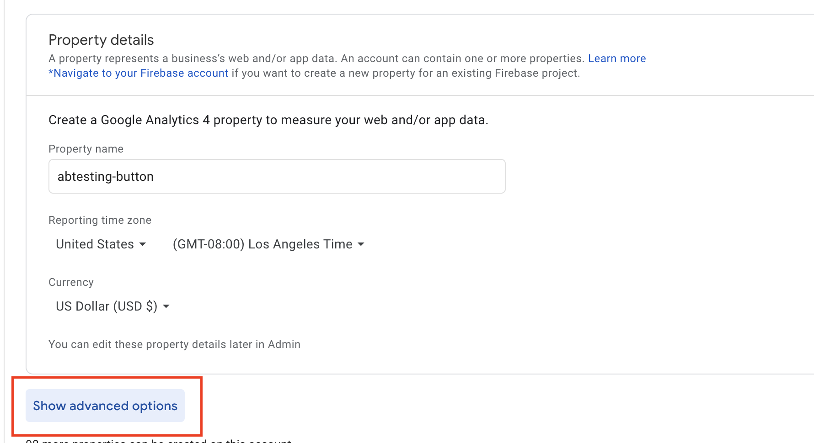
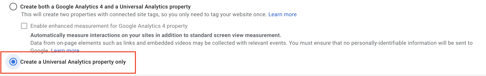
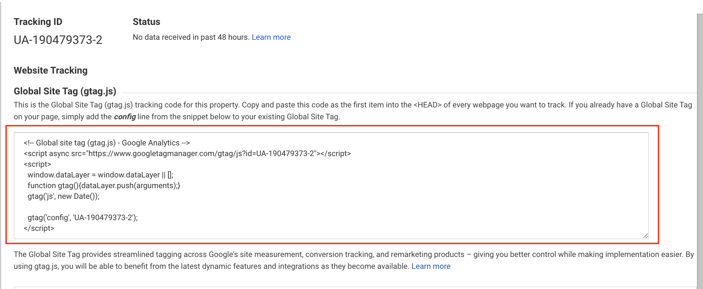
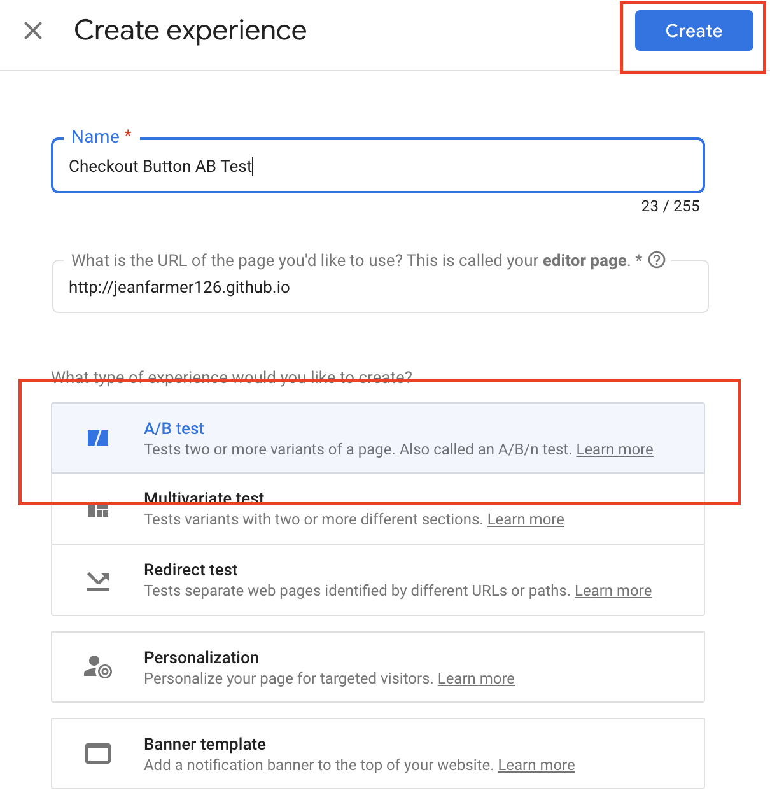
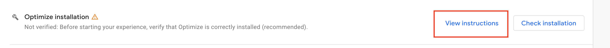

## Lab

Website:

- fork repo git@github.com:jeanfarmer126/abtesting-site.git into a new repo
- go to settings
- scroll down to github pages
  

Google Analytics:

- Navigate to google analytics
  - https://analytics.google.com/analytics/web/#/provision/create
- Create account
- Give an account name
  - for example: your username
- Opt out of everything
- Create a property for what you will be measuring
- Give a property name
  - for example: abtesting-button
  - Show advanced options
    
    - Input the URL of your website
    - Create universal property only
      
- Answer the questions about your company size (this doesn't matter)
- Create
- Copy global site tag and copy into the head of your index.html
  
- Commit and push up your changes
  - feel free to do this within the gui instead of cloning locally
- Navigate to page and disable adblock

Optimize

- https://optimize.google.com/?utm_source=marketingplatform.google.com&utm_medium=et&utm_campaign=marketingplatform.google.com%2Fabout%2Foptimize%2F
- Create Account
  - you can opt out of all emails
- Create an experience
  - Input a name
  - Add your website
  - Select a/b test
    
- Using the editor create at least one variant to target
- Install extension
- Select the checkout button and modify the color
  - navigate to the background section and change the rgb value
- Link experience to analytics
  - select the property you just created
- Create an objective
  - page views
- Install optimize
  - Select view instructions
    
  - Copy the script snippet and paste in the head of your index.html
  - Commit and push up the changes
- Start
